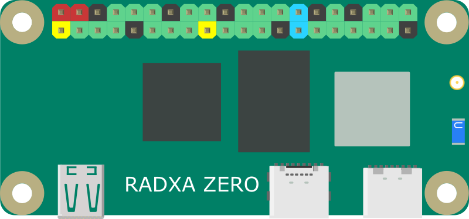
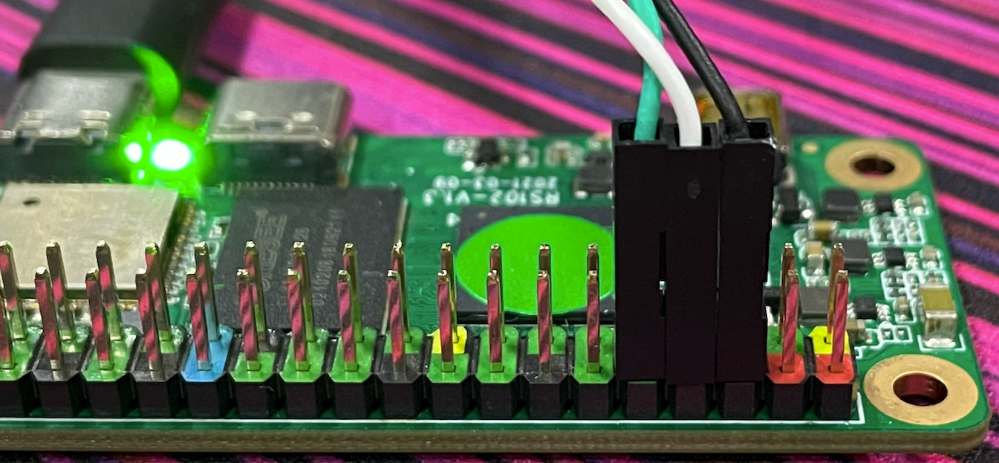

# Radxa Zero

Radxa Zero is an ultra thin SBC in small form factor with powerful performance.

Brief Specification as below:

- CPU: Quad Cortex-A53 1.8 GHz, 12nm process
- GPU: Mali G31 MP2
- RAM: LPDDR4 512MB/1GB/2GB/4GB
- Storage: eMMC 5.1 8/16/32/64/128GB and uSD card
- HDMI: Micro HDMI, HDMI 2.1, 4K@60 HDR
- Multimedia: H265/VP9 decode 4Kx2K@60
- Wireless: WiFi4/BT4 or WiFi5/BT5
- USB: One USB 2.0 Type C OTG for power&data, one USB 3.0 Type C host
- GPIO: 40Pin GPIO, ADC/UART/SPI/PWM
- Others: Crypto Engine
- Support external antenna
- One button for USB boot

## Models

| Model  | RAM   | eMMC      | WiFi/BT   |
| ------ | ----- | --------- | --------- |
| D0     | 512MB | N/A       | WiFi4/BT4 |
| D1     | 1GB   | N/A       | WiFi4/BT4 |
| D2E8   | 2GB   | 8GB       | WiFi5/BT5 |
| D4E16  | 4GB   | 16GB      | WiFi5/BT5 |
| D4E32  | 4GB   | **32GB**  | WiFi5/BT5 |
| D4E64  | 4GB   | **64GB**  | WiFi5/BT5 |
| D4E128 | 4GB   | **128GB** | WiFi5/BT5 |
|        |       |           |           |

Note: external antenna version(T variant) also available.

## PINOUT

https://wiki.radxa.com/Zero/hardware/gpio

## Quick Start Guide

https://wiki.radxa.com/Zero/getting_started

## Quick Dev Guide

### Boot Order
- Check if USB Boot button is pressed, if yes, go to USB Boot(maskrom mode), if no, go to next
- Check if eMMC is bootable, if yes, boot from eMMC
- Check if uSD card is bootable, if yes, boot from uSD card, if no, go to USB Boot(maskrom mode)

### Serial Console
Connect the cable as below picture:

Edit a new `~/.minirc.zero` file with the following content:

<pre>
pu escape-key       ^Z
pu port             /dev/tty.usbserial-110  #change this to your USB to TTL name
pu baudrate         115200
pu bits             8
pu parity           N
pu stopbits         1
pu rtscts           No
pu histlines        100000
pu logfname         /tmp/minicom.log
</pre>

Open terminal and use **minicom** to connect serial console:

    minicom zero

### Erase default Amlogic Android

- Press and hold the USB Boot button, plug the USB A to C to PC

In serial console, you should see:

    G12A:BL:0253b8:61aa2d;FEAT:E0F83180:2000;POC:D;RCY:0;USB:0;0.0

On PC, lsusb should show the followling VID/PID:

    Bus 002 Device 030: ID 1b8e:c003 Amlogic, Inc. GX-CHIP

This means the Zero is in USB Boot mode

- Use `pyamlboot` to load the fastboot loader from USB

`pyamlboot` is a tool by [@superna9999](https://github.com/superna9999/pyamlboot) for Amlogic USB Boot. To install it:

    pip3 install pyamlboot

Download the prebuilt fastboot loader:

    wget https://dl.radxa.com/zero/images/loader/factory-loader.img
    boot-g12.py factory-loader.img

It should output
<pre>
Firmware Version :
ROM: 3.2 Stage: 0.0
Need Password: 0 Password OK: 1
Writing rz-fastboot-loader.bin at 0xfffa0000...
[DONE]
Running at 0xfffa0000...
[DONE]
AMLC dataSize=16384, offset=65536, seq=0...
[DONE]
AMLC dataSize=49152, offset=393216, seq=1...
[DONE]
AMLC dataSize=16384, offset=229376, seq=2...
[DONE]
AMLC dataSize=49152, offset=245760, seq=3...
[DONE]
AMLC dataSize=49152, offset=294912, seq=4...
[DONE]
AMLC dataSize=16384, offset=65536, seq=5...
[DONE]
AMLC dataSize=1406320, offset=81920, seq=6...
[DONE]
[BL2 END]
</pre>
Now the Zero is in fastboot mode.

    $ lsusb
    Bus 002 Device 032: ID 18d1:fada Google Inc. USB download gadget  Serial: AMLG12A-RADXA-ZERO

Use fastboot to erase the eMMC

   sudo fastboot flashing unlock_critical
   sudo fastboot flashing unlock
   sudo fastboot erase bootloader
   sudo fastboot erase bootloader-boot0
   sudo fastboot erase bootloader-boot1

- The eMMC is completely wiped now, unplug and plug the USB C cable. Insert a bootable uSD card, the Zero should boot from it.

### Write images to eMMC from PC
- Boot the Zero to USB Boot mode

- Download and run the prebuilt USB Disk loader

    $ wget https://dl.radxa.com/zero/images/loader/rz-udisk-loader.bin

    $ boot-g12.py rz-udisk-loader.bin
    
    $ lsusb
    
    Bus 002 Device 004: ID 18d1:fada Google Inc. USB download gadget  Serial: AMLG12A-RADXA-ZERO

The PC should show a USB Disk device, which is the eMMC of Zero.

- Write the image to eMMC

Download the image from: https://wiki.radxa.com/Zero/downloads

    $ sudo dd if=/path/to/image of=/dev/sdx of=/dev/sdx bs=1M conv=sync

- Unplug and plug USB C, Zero should boot from u-boot in eMMC

### Android

- Build Android 9 Image

### Linux

- Build U-boot

- Build Kernel

